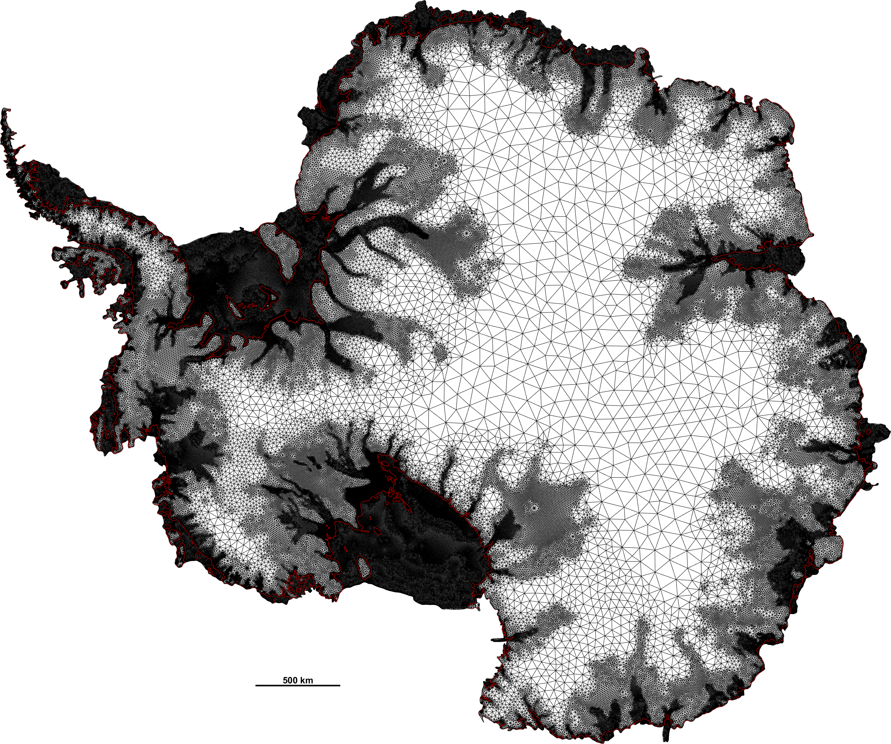

# Úa: A large-scale ice-flow model


<p align="center">
  
</p>


Úa is a finite-element ice-flow model developed at the University of
Northumbria, Newcastle, UK, by [Hilmar
Gudmundsson](https://www.northumbria.ac.uk/about-us/our-staff/g/hilmar-gudmundsson/)


A weekly-long international user meeting and workshop is held annually, usually in early June. 


[](https://doi.org/10.5281/zenodo.3706624)

Examples of simulations using this code can be found in our [YouTube
channel](https://www.youtube.com/channel/UCO8NHJqmgg_bwJx0xKJDwcA).

## Installation


The flow model is MATLAB based and you will need a matlab installation to run it.

Installing Úa is simple: Just download/clone the code for github. Put
all the files into one folder and make sure that this folder is on the
MATLAB path.

You can then test if it runs by writing

```
Ua [Ret]
```

in the MATLAB command line.

You will then find the documentation for Úa to be a part of the MATLAB
documentation system where Úa appears as a seperate toolbox.

You can, for example, set the path as:

```
     addpath(genpath('MyUaSourceFileFolder'))
```

So for example if you have cloned the source directory from github into a local folder on your own computer with the name:

```
     C:\Users\Hilmar\Ua\UaSource
```

then add that folder to the MATLAB path as:

```
addpath(genpath('C:\Users\Hilmar\Ua\UaSource')
```

You can quickly test if everything is OK by going into the UaSource directory and at the MATLAB command line do:


```
    Ua [return]
```

No special toolboxes are required, however, some optional features can
only be used with toolboxes such as the Optimisation and the Machine
Learning toolboxes.


To set up your own runs you should also download the Examples which
are in a seperate repository.  Download this into another folder, and
then you will have several different subfolders, each containing a
particular example of a model setup.


**Note:** Úa uses the mesh generator 'mesh2d' and no further steps are required if you just want to use that mesh generator.

There are many different ways of copying/cloning a repository from GitHub. You can for example download it as zip file.    
While not strictly necessary, it is presumably best to have git installed locally. You can install git from:
 
     https://git-scm.com/downloads

You can the write on the git command line:

     git clone https://github.com/GHilmarG/UaSource.git


## Brief model description.

The model is based on a vertically integrated formulation of the
momentum equations and can be used to simulate the flow of large ice
sheets such as the Antarctic and the Greenland Ice Sheets, ice caps
and mountain glaciers.

The ice-flow equations are solved on an unstructured mesh consisting
of linear, quadratic or cubic triangular elements. Various meshing
options are available, including automated mesh refinement and
coarsening. When simulating the flow of marine ice sheets these
meshing options allow, for example, the areas around grounding lines
to be automatically highly resolved as the grounding-lines migrate
through the computational domain. Elements can be activated and
deactivated. This enables the computational domain itself to change in
the course of a run, for example when simulating the growth and decay
of a large group of mountain glaciers.

Inversion for model parameters is done using the adjoint method. Both
Bayesian and Tikhonov formulations are supported, and the inversion
can be done over either nodes or elements.

Ice-thickness positivity is enforced using the active set-method. 

Forward time integration can be done in a fully coupled manner, and
the resulting non-linear system is solved using the Newton-Raphson
method.

A technical manual, the [Úa
Compendium](https://github.com/GHilmarG/UaSource/blob/master/UaCompendium.pdf),
provides a description of various mathematical and technical aspects
of the model.


## External mesh generator If in addition to 'mesh2d' you also want to
use the external mesh generator `gmsh' then define the Matlab
environmental variable 'GmshHomeDirectory' as:


```
    setenv('GmshHomeDirectory','MyDrive/Ua/Source/gmsh-4.4.1-Windows')
```


## Running Úa

You run Ua from the Matlab command line by writing:

```
Ua [Ret]
```

All run-specific input files should be in the local directory. 


##  Getting help

  You can get help on the use of Úa in the same way as you would get help on
  various in-build matlab commands by writing 

```
     help Ua  
```

in the matlab command line,  or 

```
    doc Ua 
```

Most m-files that are part of the Úa program have some inbuild help text, for example try 

    doc Ua2D_DefaultParameters
 



[Hilmar Gudmundsson](mailto:hilmar.gudmundsson@northumbria.ac.uk)

